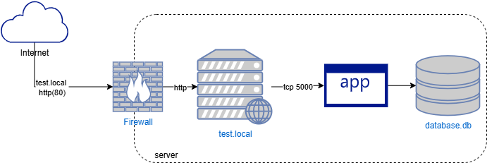

## Архитектура проекта

Схема показывает доступ к веб-серверу test.local по HTTP-протоколу, который проксирует запросы на flask-приложение.

## Подготовка сервера:
Дла запуска плэйбука нужно:
- сервер с установленной системой Ubuntu, 
- пользователь devops с правами sudo,
- нужно добавить публичный ключ пользователя devops в ~/.ssh/authorized_keys на всех целевых серверах, где будет развертываться приложение. Это обеспечит возможность подключения без пароля.
- чтобы запускак плэйбука нужно настроить inventory файл с нужными хостами и авторизацией по ssh-ключу
- плэйбук работает только на ubuntu серверах

## Структура роли

roles/
└── task1_role/
    ├── defaults/
    │   └── main.yml
    ├── files/    
    │   ├── Dockerfile
    │   ├── backup_db.sh
    │   ├── check_services.sh    
    │   ├── docker-compose.yml
    │   └── collect-metrics.sh
    ├── handlers/
    │   └── main.yml
    ├── tasks/
    │   ├── main.yml
    │   ├── docker.yml
    │   └── default.yml
    ├── templates/
    │   ├── 10-flask-auth.conf.j2
    │   ├── docker-compose.yml.j2
    │   ├── flask-auth.j2
    │   ├── flask-auth.service.j2
    │   ├── nginx-app.conf.j2
    │   └── nginx-docker.conf.j2
    └── vars/
       └── main.yml

## Использование плэйбука

    Плэйбук можно запускать в двух режимах:

    1. ansible-playbook -i ../inventory.ini task1.yml -e "deployment_mode=default" --become -K
       Если плэйбук запускается без  параметров или с параметром deployment_mode=default - плэйбук выполняется на одном хосте(веб-сервер + приложение работают на одном хосте)
    
    2.  ansible-playbook -i ../inventory.ini task1.yml -e "deployment_mode=docker" --become -K
        В этом случае приложение разворачивается в контейнерах

## Доступ к приложению
    Добавьте запись в файл hosts: "ip-адрес_хоста  test.local". 
    После настройки файла hosts:
    -  Откройте веб-браузер
    -  В адресной строке введите: http://test.local
    -  Должна открыться форма для авторизации
